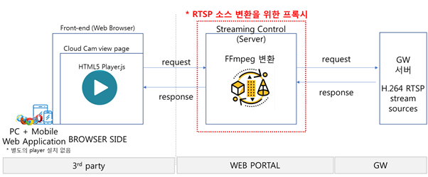

# [sk브로드밴드] cloudcam 영상(cctv) API를 활용한 개발/아이디어 공모전

## cctv의 사용목적?
- 대부분의 cctv 사용목적은 보안이나 감시용이다. 그래서 cctv는 24시간동안 동작하며, 이것은 cctv의 가장 큰 특징이다. 이런 특징은 cctv에 꼭 필요하지만 어떻게보면 이것은 큰 낭비이다. 24시간 내내 동작하지만 실제로 cctv의 진가가 발휘되는 순간은 극히 적기 때문이다. 대부분의 영상은 그저 뒤로 흘러가고 결국 시간이 흘러 언젠가 사라지게 된다. 그래서 우리는 cctv의 이런 본질적인 부분을 보완할 수 있는 방법에 대해 생각해보게 되었다.

## 아이디어
1. cctv 낭비에 대한 해결책으로 공유하는 것에 대해 생각해 보았다. 이렇게 낭비되는 cctv 영상들을 모두에게 공유하면 어떨까? 그리고 공유된 영상을 사람들로 하여금 유용하게 쓰이게 하면 어떨까?

2. cctv 영상이 모두에게 공유가 되어 많은 사람들이 유용하게 쓸 수 있는 주제가 뭐가 있을까? 이런 생각 끝에, 사회적 문제와 연결지어 보았고 그 중 하나가 바로 반려견에 대한 주제였다.

3. cctv 영상 공유와 반려견? 여기서 최종 아이디어에 도달했다. 바로 반려견 실종문제를 cctv 영상 공유를 통해 해결하는 것이었다.

## 반응형 web으로 개발 시작
1. web과 mobile 두 가지의 플랫폼으로 SDK가 제공됐다. 우리는 플랫폼 상관없이 서비스를 제공해보면 어떨까? 생각하여 반응형 web으로 개발을 시작했다.

## 구조

1. 스트리밍 서버 변환
클라우드캠의 CCTV 영상은 RTSP ( Real-time Streaming Protocol ) 서비스로 제공이 됐다. 문제점은 RTSP 기반의 스트리밍 서비스는 웹 브라우저상에서 직접 재생할 수 없었다. 따라서 이를 위한 별도의 서버를 구축, 이를 통해 HLS, FFMpeg 등 다양한 스트리밍 방식으로 전환하여 서비스 해야한다.

2. 역방향 Proxy 서버 구축
멀티미디어 데이터 스트리밍 전송의 경우, 일정 대역폭을 요구하고 지연에 민감하다. 따라서 네트워크의 예측할 수 없는 지연, 패킷 손실 등 다양한 문제점이 발견이 되고 안정적인 전송을 하기 위해 프록시 서버가 필요하다.

## 겪은 문제
- 프록시 서버에서 웹소켓 데이터가 계속 날라오는 것까지 확인이 됐는데 영상이 안나온다.
[영상]

- 해결
[영상]

문제는 바로 시간이었다. 처음에 웹 소켓에 연결하고 이 후에 수신된 스트리밍 데이터를 받기까지 시간이 2초 정도 걸린다. 즉, 처음에 소켓 연결을 하고 즉시 영상을 띄우려 했기 때문에 시간 차로 인해 영상이 나오지 않았던 것이었다. 그래서 프록시 서버로 웹 소켓 요청을 보낸 후, setTimeOut 함수를 두어 시간을 3초 정도 기다린 후 데이터를 수신했고 위와 같이 영상이 잘 나오는 것을 확인했다.

## 완성
[영상]

## 결과
- 아쉽지만 개발 부문은 떨어지고 아이디어 부문이 당선됐다.

## 최종발표
[영상]

## 3등 우수상

개발 부문에서 떨어져서 아쉽지만.. 스트리밍 관련 개발은 처음해봐서 공부도 많이 됐고 영상 스트리밍 관련 개발이라 눈으로 보는 재미가 있었다.
세상에 모습을 드러내지도 못한 체 아무도 모르게 사라진. 이번 개발은 너무나 아쉽지만 이렇게 기록으로 남긴다. 
다음 도약을 위한 발판이 되겠지?
